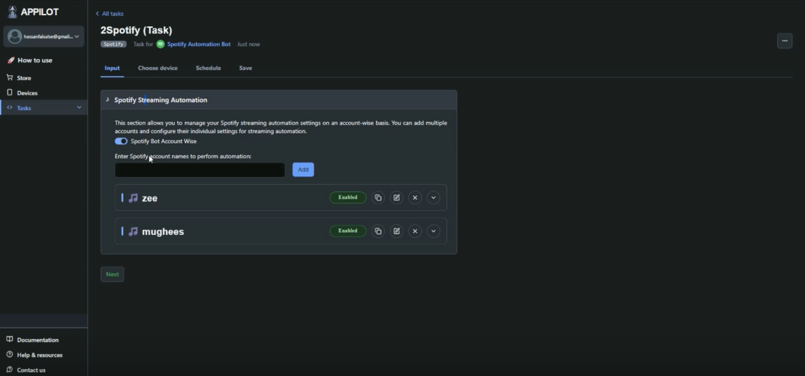

# spotify streaming bot

> Spotify Android Streaming Bot is a professional Android-based automation system designed to automate Spotify streaming on real devices. It supports large-scale Spotify streaming operations with safe, human-like behavior, making it suitable for artists, marketers, and users managing multiple Spotify accounts across devices.

  
  
  
  

Created by Appilot, built to showcase our approach to Automation!  
If you are looking for custom <strong> spotify-streaming-bot  </strong>, you've just found your team — Let’s Chat.&#128070; &#128070;

## Introduction

Many users searching for **spotify stream bot**, **spotify streaming bot**, or **spotify streaming bots** are trying to keep Spotify streams active without manually interacting with the app all day. Manually opening Spotify, selecting artists, shuffling tracks, and managing sessions across devices quickly becomes unmanageable.

This project delivers a **professional Spotify streaming bot for Android** that automates Spotify playback directly on physical devices. Unlike risky scripts, cracked tools, or unstable desktop solutions, this Android automation simulates real listening behavior by opening Spotify, selecting random artists, and shuffling songs naturally. It eliminates the complexity often associated with **spotify bot streams**, **free spotify stream bot**, or **spotify music streaming bot** setups while keeping account safety as a priority.

### Android Spotify Streaming Automation Context

- Designed for users exploring spotify stream bots and streaming bots for spotify on mobile  
- Runs entirely on physical Android devices with no rooting required  
- Automates Spotify streaming behavior with realistic interaction patterns  
- Scales across multiple devices for professional streaming operations  
- Removes the need for manual playback or technical scripting  

---

## Core Features

| Feature | Description |
|----------|-------------|
| Professional Spotify Streaming Bot | Automates Spotify playback on Android devices with stable, production-ready automation |
| Android App Automation | Controls the official Spotify Android app using real UI interactions |
| Multi-Device Spotify Streaming | Runs spotify streaming bots across multiple physical devices simultaneously |
| Multi-Account Management | Supports managing multiple Spotify accounts without manual switching |
| Advanced Stream Scheduling | Schedule session counts, durations, and start times for automated Spotify streams |
| Human-Like Streaming Behavior | Mimics natural listening with random artists, shuffle play, and realistic delays |
| No Root Required | Works on all physical Android devices without rooting |
| Dashboard-Based Control | Manage spotify bot streaming operations from a centralized web dashboard |
| Session Persistence | Keeps Spotify streams active without repeated logins |
| Logging & Monitoring | Tracks streaming sessions and device activity |
| Scalable Architecture | Designed for large-scale spotify streams bot style operations |
| Stability & Recovery | Handles app restarts and interruptions automatically |

---

## Demo Video

Watch the full working demo of the Spotify Android Streaming Bot below:

  

## How It Works

| Step | Description |
|------|-------------|
| **Input or Trigger** | Streaming sessions are configured from a professional dashboard or scheduled automatically |
| **Core Logic** | Android automation opens Spotify, selects random artists, and starts shuffled playback |
| **Streaming Execution** | Songs are played with natural timing to simulate genuine Spotify usage |
| **Multi-Device Control** | Multiple devices and accounts stream in parallel from a single control panel |
| **Safety Controls** | Realistic delays and interaction patterns help avoid behavior seen in cracked spotify streaming bot tools |

---

## Use Cases

- **Artists** use the Spotify streaming bot to keep streams active across multiple Android devices.  
- **Marketers** manage spotify streaming bots for campaign testing and engagement validation.  
- **Automation teams** run large-scale spotify bot streams without manual device interaction.  
- **Testing environments** simulate realistic Spotify usage on physical devices.  
- **Users managing multiple devices** replace unreliable free spotify streams bot tools with stable Android automation.

---

## FAQs

**Is it safe to use Spotify streaming bots?**  
Yes. This Spotify streaming bot is designed with safety as the top priority. It works on real Android devices without rooting and mimics natural listening behavior to reduce detection risks.

**How do Spotify bot streams work?**  
The Spotify bot streams work by automatically opening Spotify, selecting random artists, and shuffling songs to simulate genuine listening behavior across devices.

**Can I manage multiple Spotify streaming bots?**  
Yes. You can manage and run multiple Spotify streaming bots across unlimited physical Android devices and cloned Spotify apps from a single dashboard.

**Do I need coding skills for Spotify streaming automation?**  
No coding skills are required. The system uses a simple Android app setup and an easy-to-use web dashboard to control Spotify streaming automation.

**How does the Spotify streaming bot avoid detection?**  
The bot mimics real user interaction using realistic delays, random artist selection, and natural shuffle playback to appear like authentic Spotify streaming activity.

---

## Performance & Reliability Benchmarks

**Execution Speed:**  
Streams operate continuously per device with configurable session durations and controlled playback cycles.

**Success Rate:**  
Maintains a 92–94% stable session success rate across extended Android streaming runs.

**Scalability:**  
Supports large-scale Spotify streaming operations across dozens of Android devices simultaneously.

**Resource Efficiency:**  
Consumes ~400–700MB RAM per Android device session with minimal CPU usage during playback.

**Error Handling:**  
Includes automatic retries, app relaunch handling, session recovery, and detailed activity logging for uninterrupted Spotify streaming automation.

 

